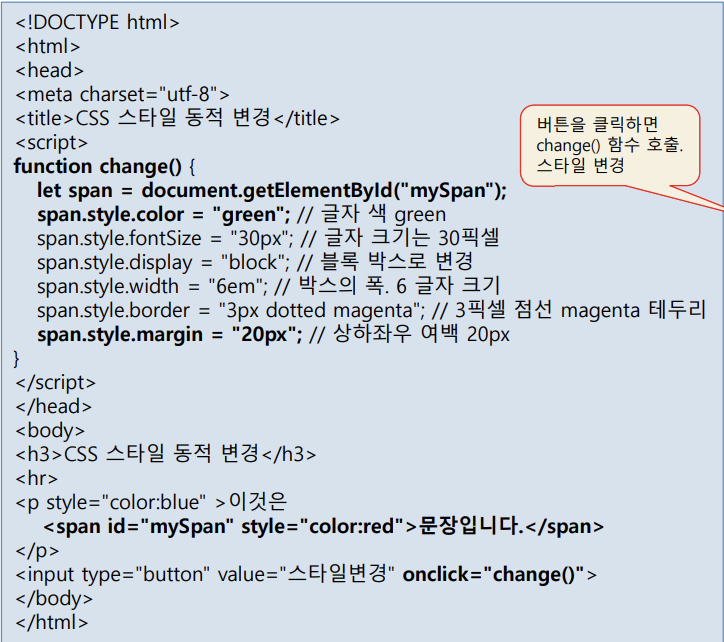
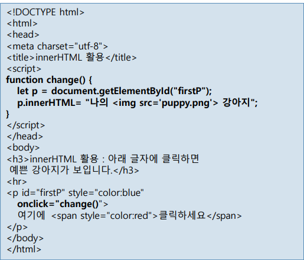
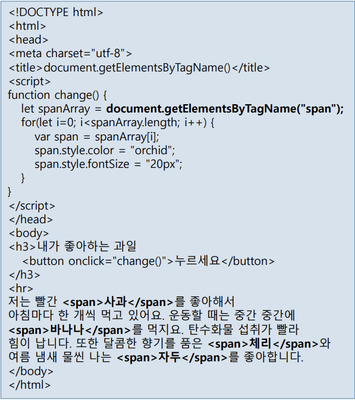
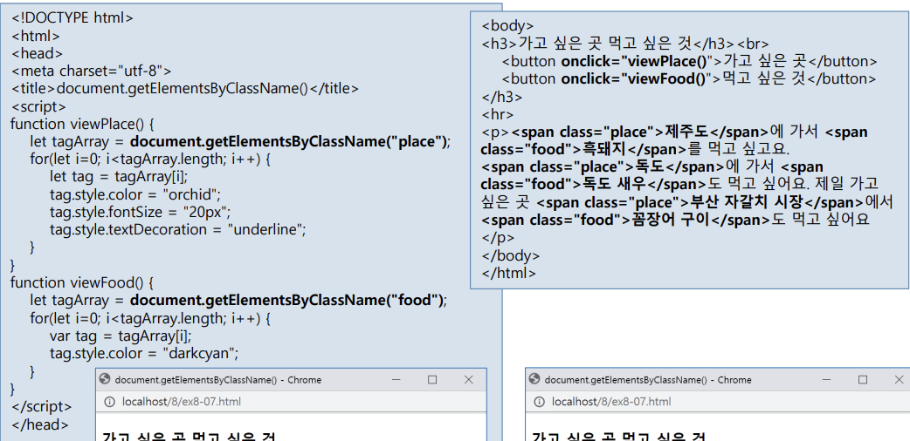
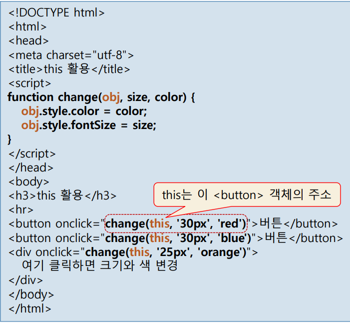
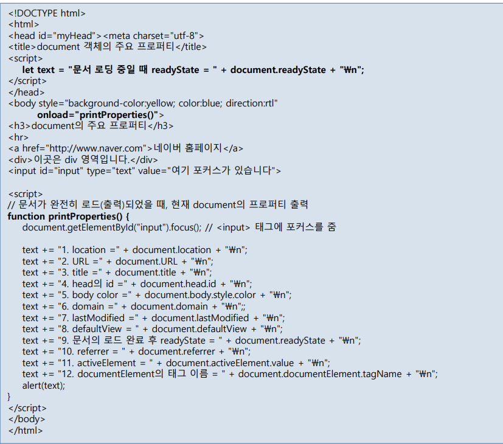

<pre>
- <mark> 객체 </mark> -
자바에서 쓸 수 있는 객체는 코어객체, Dom, Bom이 있습니다.

<b>코어객체 </b>-
코어 객체는 자바스크립트 언어 자체에 기본적으로 포함된 내장 객체로, 웹과 무관하게 언제나 사용할 수 있는 객체입니다.

<b>Dom </b>-
브라우저가 서버에 HTML문서를 요청하면, 서버는 응답에 응하여 브라우저에 HTML파일을 보내줍니다. 
브라우저는 받은 HTML 코드를 한줄씩 읽으며 각 엘리먼트와 그 관계를 확정하여 트리구조로 바꾸고, 렌더링 되어 
코드 그대로 화면 출력이 일어납니다. 이때 Dom은 HTML 문서의 태그 , 속성, 스타일, 이벤트 리스너, 콘텐츠 등
문서를 구성하는 모든 요소를 노드로 표현하고, 노드 간의 계층적 관계를 만들어 구조를 확정 해주는 역할을 합니다. 

<b>Bom </b>-
BOM 객체는 브라우저 자체를 제어하거나 정보에 접근하기 위한 객체로, window, location, history, navigator, screen 등이 포함됩니다.

- <mark> Dom활용 </mark> -
(ex1) 
  
  
- let span = document.getElementById("mySpan");  이 코드에서 myspan이라는 ID를 가진 엘리먼트 전체를 span이라는 객체에 가져오고, 
  span객체에 css를 적용하여 버튼을 클릭(on click)하면 "문장입니다" 라는 텍스트 스타일이 바뀌게 설정이 되어 있고, 클릭하지 않으면
  원래 스타일인 span태그의 글자색이 빨간색(" style="color:red)으로 적용되는걸 볼 수 있습니다.

(ex2) 
  

- p라는 객체에 클릭하세요 이 내용을 모두 담고, p.innerHTML= "나의 &lt;img src='puppy.png"&gt; 강아지" 는 p객체에 
  "나의 &it;img src='puppy.png'&gt; 강아지" </code> 라는 내용을 덮어 쓰게 됩니다. 그렇기에 onclick="change()" 
  즉 마우스가 해당 문구에 클릭이 되면 해당 이미지가 화면에 출력 되어지는 것을 볼 수 있습니다. 
  
(ex3)
  

- let spanArray = document.getElementsByTagName("span"); 라는 코드를 써 spanArray라는 객체가 span태그가 나온 순서대로 
spanArray[0] = 사과, spanArray[1] = 바나나... 이런식으로 배열에 넣어집니다. 함수에는  배열의  개수만큼 반복하고 
배열에 있는 태그 모두 글자색, 폰트 사이즈를 바꿉니다. 이 함수는 버튼을 클릭 하였을 시에 호출이 됩니다.

(ex4)
  
  
- <mark>this</mark> -
this는 현재 실행중인 객체를 가리키는 키워드입니다.
(ex1)
  

- 이 예제는 각 버튼과 텍스트를 클릭시 파라미터값에 따라 글자의 색과 사이즈가 들어가는 코드입니다. function change(obj, size, color) 라는 메소드를 만들고, 
  버튼을 클릭하면 이 함수가 호출이 되는데 obj대신 this로 인해 각 버튼이 객체로 만들어지고, size, color가 설정한 파라미터 값으로 바뀝니다.

- <mark>document</mark> -
document는 HTML 문서 전체를 대변하는 객체로서, 트리 구조(DOM)에서 최상위에 위치하며 모든 태그는 document의 하위 객체입니다. 반대로 말하면 
document가 문서 전체를 대표하는 최상위 객체이다입니다. 그렇기에 웹 문서의 구조, 내용, 스타일, 상태 등의 정보를 읽거나 변경할 수 있습니다. 
document를 사용하는 예시를 보겠습니다.
(ex1) 
  

- 예시를 보면 document를 이용하여 문서의 정보를 살펴보고 있습니다.

  
  
자식이 몇개 있는지 컬렉션에서 불러와 확인할 수 있다.
p.style  p.prompt    p라는 객체에서 브라우저에서 다루어짐

p10
자식의 첫번째는 firstElementChild, 마지막 자식은 lastElementChild

~~

~

p25
wirte(), writeln()는 빈칸 한칸이기에  을 쓴다.

  

--chapter 9-
자바스크립트는 이벤트 앞에 on을 붙인다.

p7
이벤트가 발생하면 함수 호출 가능함

p23
클릭이벤트가 있으면 모든 노드에서 이벤트 타켓을 찾고(이벤트 캡쳐단계) = 위에서 아래로 이벤트 리스너를 찾는 것
해당 이벤트에서  window까지가는 단계를 event bubble 이라고 함

p11
익명함수는 호출 되었을 때 이름을 부여함

p13 시험문제 내기 좋음

p15
이벤트 리스너 객체 e는 자동으로 만들어짐 
e는 메소드하고, 프롬퍼티의 정보가 들어있음
접근은 e.(명령)으로 접근 해 주면 됩니다.

p19
이벤트 디폴트로 이벤트의 행동을 취소할 수 있다.

p27
이벤트 흐름을 event.stopPropagation();로 중단 시킬 수 있음

p30
마우스 이벤트 

p43
포커스 = 마우스가 위에 있는거
onblur = 포커스를 잃었을때
onfocus = 포커스를 얻었을때

p45
라디오의 옵션을 추가할려면 같은 이름의 밸류를 채워야한다

</pre>

