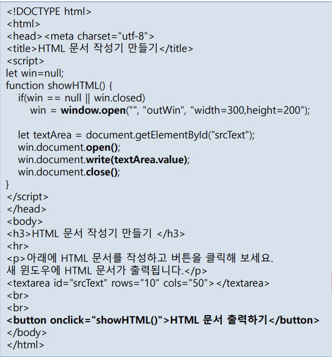

<pre>
--------------------------------------------------------chapter 8---------------------------------------------------------------
  
- <mark> 객체 </mark> -
자바에서 쓸 수 있는 객체는 코어객체, Dom, Bom이 있습니다.

<b>코어객체 </b>-
코어 객체는 자바스크립트 언어 자체에 기본적으로 포함된 내장 객체로, 웹과 무관하게 언제나 사용할 수 있는 객체입니다.

<b>Dom </b>-
브라우저가 서버에 HTML문서를 요청하면, 서버는 응답에 응하여 브라우저에 HTML파일을 보내줍니다. 
브라우저는 받은 HTML 코드를 한줄씩 읽으며 각 엘리먼트와 그 관계를 확정하여 트리구조로 바꾸고, 렌더링 되어 
코드 그대로 화면 출력이 일어납니다. 이때 Dom은 HTML 문서의 태그 , 속성, 스타일, 이벤트 리스너, 콘텐츠 등
문서를 구성하는 모든 요소를 노드로 표현하고, 노드 간의 계층적 관계를 만들어 구조를 확정 해주는 역할을 합니다. 

<b>Bom </b>-
BOM 객체는 브라우저 자체를 제어하거나 정보에 접근하기 위한 객체로, window, location, history, navigator, screen 등이 포함됩니다.

- <mark> Dom활용 </mark> -
(ex1) 
  
  
- let span = document.getElementById("mySpan");  이 코드에서 myspan이라는 ID를 가진 엘리먼트 전체를 span이라는 객체에 가져오고, 
  span객체에 css를 적용하여 버튼을 클릭(on click)하면 "문장입니다" 라는 텍스트 스타일이 바뀌게 설정이 되어 있고, 클릭하지 않으면
  원래 스타일인 span태그의 글자색이 빨간색(" style="color:red)으로 적용되는걸 볼 수 있습니다.

(ex2) 
  

- p라는 객체에 클릭하세요 이 내용을 모두 담고, p.innerHTML= "나의 &lt;img src='puppy.png"&gt; 강아지" 는 p객체에 
  "나의 &it;img src='puppy.png'&gt; 강아지" </code> 라는 내용을 덮어 쓰게 됩니다. 그렇기에 onclick="change()" 
  즉 마우스가 해당 문구에 클릭이 되면 해당 이미지가 화면에 출력 되어지는 것을 볼 수 있습니다. 
  
(ex3)
  

- let spanArray = document.getElementsByTagName("span"); 라는 코드를 써 spanArray라는 객체가 span태그가 나온 순서대로 
spanArray[0] = 사과, spanArray[1] = 바나나... 이런식으로 배열에 넣어집니다. 함수에는  배열의  개수만큼 반복하고 
배열에 있는 태그 모두 글자색, 폰트 사이즈를 바꿉니다. 이 함수는 버튼을 클릭 하였을 시에 호출이 됩니다.

(ex4)
  

- let tagArray = document.getElementsByClassName("place"); 라는 코드를 써 tagArray라는 객체가 Class name이 "place"인 태그가 나온 순서
  대로tagArray[0]부터 차례대로 넣고, css를 적용하고, let tagArray = document.getElementsByClassName("food"); 코드도 마찬가지로 Class name
  이"food"인 태그가 나온 순서대로 tagArray[0]부터 차례대로 넣습니다. 이떄 tagArray라는 객체는 서로 독립된 공간이기에 공유되지 않습니다. 
  그렇기에 둘의 함수가 시행되었다고 한들 서로 독립적으로 tagArray[0]부터 증가 됩니다.

<b>Dom객체 생성, 삽입, 삭제</b> -
Dom으로 문서의 정보를 알 수 있는 동시에 반대로 생성, 삽입, 삭제 기능도 직접 구현 할 수 있습니다.
(ex1 - 생성) 
  

- let newDIV = document.createElement("div"); 이 코드에서 div라는 태그를 가지는 newDIV객체를 만들었고 
  newDIV.innerHTML = "새로 생성된 DIV입니다."; 이 코드에서는 div코드에 텍스트를 입력하였고,
  마지막으로 newDIV.setAttribute("id", "myDiv"); id가 "myDiv"인 newDIV인 객체를 만들고,     
  newDIV.style.backgroundColor = "yellow"; 바탕색을 지정하였습니다.
  이 구조를 HTML로 나타내면 &lt;div id="myDiv" style="background-color: yellow;"&gt; 새로 생성된 DIV입니다. &lt;/div&gt;   입니다. 

(ex2 - 삽입)
  

- 생성한 newDIV 객체는 &lt;p "id=p"&gt; 태그의 자식이 됩니다.
  
(ex3 - 삭제)
  

- let parent = myDiv.parentElement;  에서 myDIV의 부모 태그를 parent객체에 넣고, parent.removeChild(myDiv); 의 코드는 
  myDIV의 부모인 parent에서 자식태그 제거를 의미합니다.
  
- <mark>this</mark> -
this는 현재 실행중인 객체를 가리키는 키워드입니다.
(ex1)
  

- 이 예제는 각 버튼과 텍스트를 클릭시 파라미터값에 따라 글자의 색과 사이즈가 들어가는 코드입니다. function change(obj, size, color) 라는 메소드를 만들고, 
  버튼을 클릭하면 이 함수가 호출이 되는데 obj대신 this로 인해 각 버튼이 객체로 만들어지고, size, color가 설정한 파라미터 값으로 바뀝니다.

- <mark>document</mark> -
document는 HTML 문서 전체를 대변하는 객체로서, 트리 구조(DOM)에서 최상위에 위치하며 모든 태그는 document의 하위 객체입니다. 반대로 말하면 
document가 문서 전체를 대표하는 최상위 객체이다입니다. 그렇기에 웹 문서의 구조, 내용, 스타일, 상태 등의 정보를 읽거나 변경할 수 있습니다. 
document를 사용하는 예시를 보겠습니다.
(ex1) 
  

- 예시를 보면 document를 이용하여 문서의 정보를 살펴보고 있습니다.

<b>document write / writeln</b> -
write는 HTML 문서에 직접 내용을 쓰는 자바스크립트 명령입니다. 보통 ln은 붙이면 한줄 들여쓰기인데 자바 스크립트에서는 한 칸 들여쓰기로 인식이 되어
document를 활용하여 한줄 들여쓰기를 하려고 하면 &it;br&gt; 태그를 써야 합니다.
(ex1)
  
  
<b>document open/close</b> -
document.open()은 작성한 HTML코드를 초기화 하고 다시 트리를 만드는 작업에 돌입하는 것이고, document.close()는 document.open() 메서드를 실행 후
작성이 완료되면 트리 구조를 확정 짓는 메서드입니다.
(ex1)
  

- win = window.open("", "outWin", "width=300,height=200"); 이 코드는 새로 열린 창을 가리키는 window 객체를 win 변수에 저장하는 것이고, ID가 
  "srcText"인 태그를 textArea객체에 저장 후 아무것도 없는 새창(win.document.open())에 teatArea에 있는 값을 그대로 출력하고 새창 입력을 종료
  합니다(win.document.close();). 만약 처음 화면에 출력되어었던 textArea태그에 아무것도 적지 않았다면, 새창이 열리고도 아무것도 출력이 안되는걸
  볼 수 있습니다.
  
--------------------------------------------------------chapter 9---------------------------------------------------------------

  - <mark>이벤트</mark> -
마우스 클릭, 키보드 입력, 이미지나 HTML 문서의 로딩, 타이머 의 타임아웃 등 사용자의 입력 행위나 문서나 브라우저의 상태 변화를 
자바스크립트 코드에게 알리는 통지입니다. 이벤트가 일어나면 어떻게 행동을 해야할지 알려주는 코드가 "이벤트 리스너" 입니다.
이벤트 리스너를 만드는 방법은
1. HTML 태그 내에 작성
2. DOM 객체의 이벤트 리스너 프로퍼티에 작성
3.  DOM 객체의 addEventListener() 메소드 이용
이렇게 총 3가지가 있습니다.

<b>이벤트 리스너(HTML 태그 내에 작성)</b> -
이벤트 리스너를 HTML 태그 내에 작성하는 방법은 이벤트를 지정할 떄 on 앞에 붙여  "on이벤트" 가 이벤트 리스너가 됩니다.
(ex1)
    

- mouseover(마우스를 올릴떄), mouseout(마우스를 밖으로 지정할떄) 라는 이벤트 앞에 on을 붙여 이벤트 리스너로 만들었고, 
이벤트 리스너가 실행 되면 실행할 동작이 이벤트 리스너 오른쪽에 적혀 있습니다. 
  
<b>이벤트 리스너(이벤트 리스너 프로퍼티)</b> -
DOM 객체의 이벤트 리스너 프로퍼티에 작성방법은 Dom객체를 만들고 만든 객체에 이벤트리스너를 적용 시키는 방법입니다.
(ex1)
  

- ID가 "p"인 객체를 변수p에 담고 p가 이벤트(mouseover, mouseout)이 일어나면 각각 over(), out() 함수를 호출합니다.  

<b>이벤트 리스너(addEventListener 메소드 사용)</b> -
addEventListener사용 방법은 [객체.addEventListener("이벤트", 함수)] 입니다. 지정한 객체가 이벤트를 시행하면 두 번째 
매개변수로 전달한 함수가 자동으로 호출되어 동작을 수행합니다.
(ex1)
  

- ID가 "p"인 객체를 변수p에 담고 addEventListener에 담긴 이벤트가 일어나면 함수가 호출 됩니다.

<b>이벤트 객체</b> -
이벤트 리스너가 이벤트를 받으면, 브라우저가 이벤트 객체를 만들어서 그 안에 정보를 넣어 줍니다. 
이벤트 한번당 1개의 이벤트 객체를 만들고, 이벤트 행동이 완료되면 이벤트 객체의 정보는 소멸하게 됩니다.
(ex1)
  

- "클릭하세요"라는 버튼을 클릭하면 event객체가 클릭한 정보를 얻게 됩니다. 그리고 "p"인 태그에 마우스를 올리면 f함수가
  실행되고, 둘 모두 어떤 이벤트인지 화면에 출력이 됩니다. type은 프로퍼티로 객체가 가진 이벤트를 알려주는 역할입니다.
  또 다른 프로퍼티를 알아보자면 target, currentTarget, defaulPrevented, prevenDefault()가 있습니다.
  각 의미하는바로는 이벤트를 유발시킨 DOM 객체(target), 이벤트 리스너가 붙어 있는 DOM 요소 객체(currentTarget), 
  이벤트 디폴트 값이 취소 되었는지 나타내는 true, false 값(defaulPrevented), 이벤트의 디폴트 값을 취소시키는 
  메소드(prevenDefault())입니다.
  
- <mark>익명 함수</mark> -
  함수 안의 코드가 길지 않을 때는, 함수 이름을 따로 만들지 않고 필요한 위치에 바로 작성하는 함수를 익명 함수라고 합니다.
(ex1)
  

- 예시를 보면 p.onmouseover 객체 p의 이벤트 리스너에 대한 행동이 배경색을 바꾸는 것으로 코드가 짧고, 단순하여 [function () { }] - 익명함수
  에 넣어 사용하고, p.addEventListener("mouseout", function () { this.style.backgroundColor="white"; } 이 코드도 이벤트 리스너에서 실행되는 
  동작이 짧고 단순하기 때문에, 별도의 함수 이름을 만들지 않고 익명 함수로 바로 작성하여 CSS를 적용합니다.

- <mark>이벤트 흐름</mark> -
이벤트가 발생하면 window 객체에 먼저 도달하고, DOM 트리를 따라 이벤트 타겟에 도착하고, 다시 반대 방향으로 흘러 window 객체에 도달한 다음
사라지는 과정입니다. 이벤트를 만나면 총 3단계로 처리가 되는데 캡처 단계 -> 이벤트 타깃 -> 버블 단계 순으로 처리가 됩니다.
캡쳐단계는 이벤트가 문서 최상위에서 타깃 요소까지 내려가는 단계를 의미하고, 이벤트 타깃은 이벤트가 정확히 발생한 요소에 도달하는 단계를
의미하고, 버블단계는 이벤트 타깃 요소에서 문서 최상위까지 올라가는 단계를 의미합니다. 만약 이벤트 흐름을 중단 시키고 싶다면 이벤트 
객체가 event일때 event.stopPropagation(); 으로 흐름을 중단 시킬 수 도 있습니다.

- <mark>다양한 이벤트</mark> -

<b>마우스 이벤트</b> -
onclick - HTML 태그가 클릭될 때
ondblclick - HTML 태그가 더블 클릭될 때
onmousedown - 마우스 버튼을 누르는 순간
onmouseup - 눌러진 버튼이 놓여지는 순간
onmouseover - 마우스가 태그 위로 올라오는 순간. 자식 영역 포함
onmouseout - 마우스가 태그 위로 올라오는 순간. 자식 영역 포함
onmouseenter - 마우스가 태그 위로 올라오는 순간. 버블 단계 없음
onmouseleave - 마우스가 태그 위로 올라오는 순간. 버블 단계 없음
onmousemove - 마우스를 움직일 때마다 실행되는 이벤트 핸들러
oncontextmenu - 마우스 오른쪽 버튼을 눌렀을 때 실행되는 이벤트 핸들러
onwheel - HTML 태그에 마우스 휠이 구르는 동안 계속 호출
          (휠을 위로 굴리면 wheelDelta > 0, 아래로 굴리면 wheelDelta < 0)
            
그외에는 
이벤트객체.x / 이벤트 객체.y - 
이벤트 객체.clientX / 이벤트 객체.clientY - 브라우저 기준 x, y 좌표값 제공
이벤트 객체.screenX / 이벤트 객체.screenY - 모니터 기준 x, y 좌표값 제공
이벤트 객체.offsetX / 이벤트 객체.offsetY - 이벤트가 발생한 요소 기준 x, y 좌표값 제공
이벤트 객체.button - 0(아무것도 안눌림), 1(왼쪽 버튼 눌림), 2(오른쪽 버튼 눌림), 3(오른쪽, 왼쪽 둘다 눌림), 4(중간버튼 눌림) 
가 있습니다.

- <mark>이미지 객체</mark> -
HTML 문서의  태그는 자바스크립트에서 이미지 객체로 표현됩니다. 이 이미지 객체를 이용하면 다양한 이벤트를 처리할 수 있는데, 
그중 하나가 바로 onload 이벤트입니다. onload는 이미지가 완전히 로딩되었을 때 발생하는 이벤트로, 이미지의 크기나 상태가 준비된 
이후에 실행해야 하는 작업을 처리할 때 사용됩니다.또한, 이미 HTML에 있는 를 가져와서 이미지 객체로 다룰 수도 있고, 반대로 
비어 있는 이미지 객체를 자바스크립트로 직접 생성한 뒤 나중에 이미지를 넣어 사용할 수도 있습니다. 
(ex1)
  

- 비어 있는 이미지 객체 bananaImg를 생성하여 메모리에 할당합니다. 해당 이미지 객체를 사용하려면 img태그를 이용해야합니다.

(ex2)
  

- 이 예제는 클릭할때 마다 src가 바뀌고, 바뀌는걸 토대로 img태그를 써서 출력하고 있습니다.
  
--chapter 9-

  

p23
클릭이벤트가 있으면 모든 노드에서 이벤트 타켓을 찾고(이벤트 캡쳐단계) = 위에서 아래로 이벤트 리스너를 찾는 것
해당 이벤트에서  window까지가는 단계를 event bubble 이라고 함

p11
익명함수는 호출 되었을 때 이름을 부여함

p13 시험문제 내기 좋음

p15
이벤트 리스너 객체 e는 자동으로 만들어짐 
e는 메소드하고, 프롬퍼티의 정보가 들어있음
접근은 e.(명령)으로 접근 해 주면 됩니다.

p19
이벤트 디폴트로 이벤트의 행동을 취소할 수 있다.

p27
이벤트 흐름을 event.stopPropagation();로 중단 시킬 수 있음

p30
마우스 이벤트 

p43
포커스 = 마우스가 위에 있는거
onblur = 포커스를 잃었을때
onfocus = 포커스를 얻었을때

p45
라디오의 옵션을 추가할려면 같은 이름의 밸류를 채워야한다

</pre>

